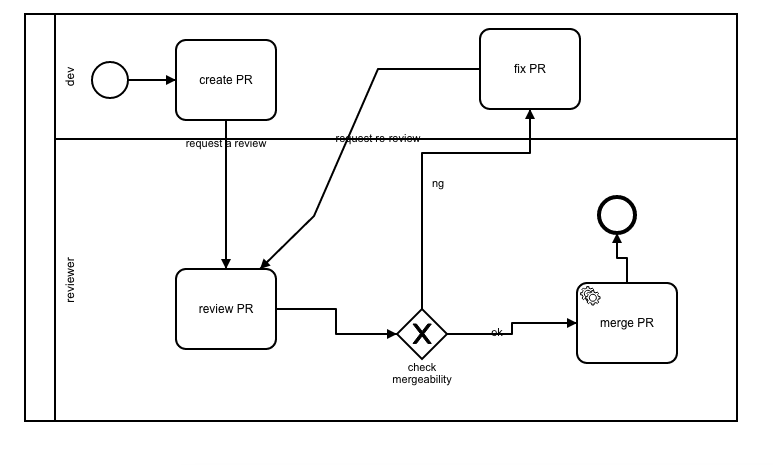
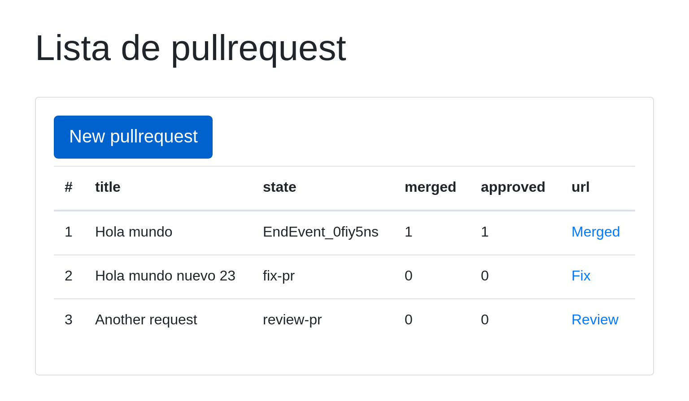
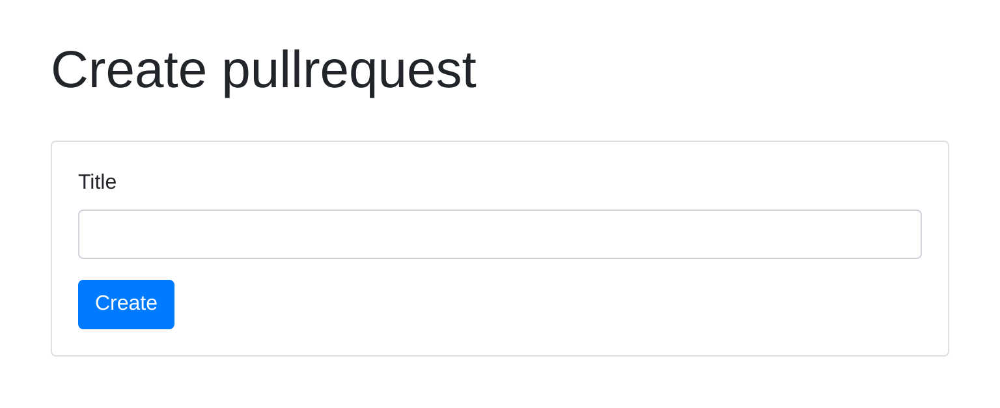
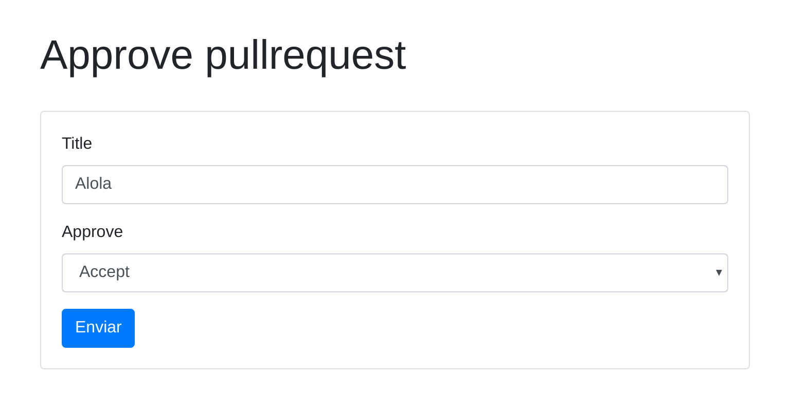
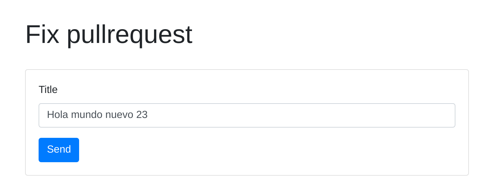

# Workflower with laravel. A Bussines Process Implementation with PHP

## Table of Contents

- [Introduction](#introduccion).
- [Installation](#installation)
- [The workflow diagram](#the-workflow-diagram)
- [Sourcecode](#sourcecode)
- [Screenshots](#screenshots)

## Introduction

This project is an example of https://github.com/phpmentors-jp/workflower  BPMN 2.0 workflow engine and Laravel 5.8 Framework integration.

I used https://github.com/77web/workflower-bundle-playground example as basis.

The bpmn file can be viewed and edited with comunda modeler. The service tasks are not supported by the visual editor but you can edit directly in the source code.

## Installation

Run composer install and and php artisan migrate command.

## The workflow diagram



## Sourcecode

### Workflow implementations

The class Process does the magic and we focus in this.

This class needs three class to work.

1. A **WorkItemContextInterface** implementation (**PullRequestWorkflow**).  This class has the workflow bpmn file name saved in the storage/app/process path.
2. A **Bpmn2WorkflowRepository** implementation (**WorkflowRepository**). The phpmentors-jp/workflower has an implementation but is useless for laravel projects.
3. A **MergePullRequestOperationRunner** implementation (**MergePullRequestOperationRunner**). This class contains the logic used by the service task merge PR. For laravel projects you most consider replace service task for simple task and use Jobs.

Additionally to this classes I create the class Workflow/Entities/**PullRequest** that implements ProcessContextInterface and WorkflowSerializableInterface interfaces. This class it is a data structure that has the necessary data for the workflow to work.

With this classes create a Process instance. 

```php
$repository = new WorkflowRepository();
$pullRequestWorkflow = new PullRequestWorkflow();
$operationRunner = new MergePullRequestOperationRunner();
$process = new Process($pullRequestWorkflow, $repository, $operationRunner);
```
We set the instance in the Usecase class and pass the Pullrequest instance in the run method.

```php
$usecase = new CreatePullRequestUsecase();
$usecase->setProcess($process); // createProcess() method in the controller class
$entity = $usecase->run($pullrequest); // $entity attribute in the controller class
return $entity;
```
### Laravel

For persistence I create a eloquent model Models/**PullRequest**. This class save the data in the database including the serialized workflow.

The **PullRequestController** is the application's start point. This class makes the calls to the workflower engine through Usecase classes.

## Screenshots







